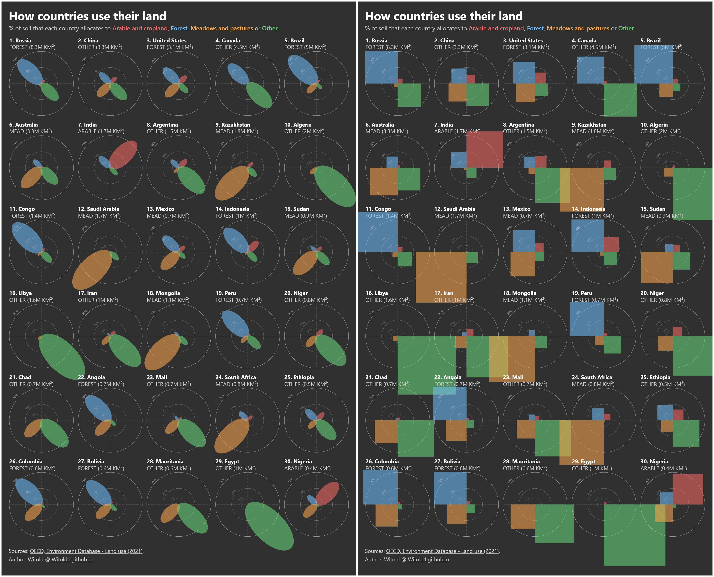

# How countries use their land

[](https://witold1.github.io/petal-land-use-chart/web/)
[](https://nbviewer.org/github/Witold1/petal-land-use-chart/blob/main/notebooks/petal-type-chart-land-use-by-country.ipynb)
<br>


<br>


<br>


## Preview

<p align="center">
  
</p>

Small-multiple petal chart of how the largest countries split land across **arable (cropland)**, **forest**, **meadows and pastures**, and **other**. Petal length is each category’s share of those four OECD percentages (renormalized to sum to 1).

Two implementations live in this repo:

- **Python** (`notebooks/`) — matplotlib poster via the `petal_chart` package
- **Interactive web tool** (`web/`) — browser version on the same stack as [petal-land-use-chart](https://github.com/Witold1/petal-land-use-chart) (vanilla ES modules, theme, presets, SVG/PNG export)

## Description

### 1. Chart

| Element | Meaning |
|---------|---------|
| Cell | One country (rank by total land area) |
| Four petals | ARABLE / FOREST / MEAD / OTHER |
| Petal length | Category share among the four OECD % values |
| Rings | 10% / 25% / 50% guides |
| Subtitle under name | Largest category + absolute km² |

Hover a country for the breakdown; click a colored category in the subtitle to highlight that petal across all flowers.

### 2. Controls

- **Theme** — light (notebook cream) / dark (remembered in `localStorage`)
- **Presets** — Top 30 / Top 50 (from `data/presets.meta.json`)
- **Export** — download SVG or PNG poster via `html-to-image` (CDN)

## Data

| Path | Contents |
|------|----------|
| `data/oecd_land_use_2021.csv` | OECD long-format land-use dump (source for the notebook) |
| `data/land_use_top50.json` | Wide table for the web app (top 50 countries) |
| `data/presets.meta.json` | Top 30 / Top 50 preset labels and captions |

See [`data/README.md`](data/README.md) for OECD measure definitions and retrieval notes.

## Run locally

JSON under `data/` is loaded over HTTP — open via a local server from the **repo root** (not as a raw `file://` page):

```powershell
python -m http.server 8080
```

Then open `http://localhost:8080/` (root `index.html` redirects to `web/`).

No bundler or package manager for the web app: ES modules and `fetch` for presets need HTTP.

### Python notebook / package

```powershell
uv sync
```

Open [`notebooks/petal-type-chart-land-use-by-country.ipynb`](notebooks/petal-type-chart-land-use-by-country.ipynb). It uses `notebooks/petal_chart/` (`load_oecd_land_use`, `land_use_long_to_wide`, `prepare_canvas`, `plot_petal`) and writes PNG under `notebooks/artifacts/`.

## Repository layout

```text
.
├── notebooks/              # Python version (refactored)
│   ├── petal-type-chart-land-use-by-country.ipynb
│   ├── petal_chart/        # matplotlib module
│   │   ├── data.py
│   │   └── plot.py
│   └── artifacts/          # Saved PNG charts
├── web/                    # Browser app
│   ├── index.html
│   ├── css/
│   │   ├── tokens.css
│   │   ├── layout.css
│   │   └── export.css
│   └── js/
│       ├── app.js
│       ├── data.js
│       ├── colors.js
│       ├── chart.js
│       ├── tooltip.js
│       └── export.js
├── index.html              # Redirects root/ -> root/web/
└── data/                   # Shared datasets
    ├── presets.meta.json
    ├── land_use_top50.json
    └── oecd_land_use_2021.csv
```

## License & credit

| Part | License |
|------|---------|
| Code (`web/`, `notebooks/`) | [MIT](LICENSE) |
| Prepared tables under `data/` | [CC BY-SA 4.0](LICENSE-DATA) — OECD/FAO source terms still apply |

_Made with AI. Curated by Human._
